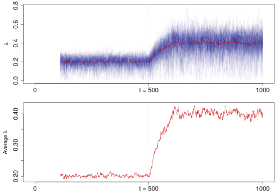
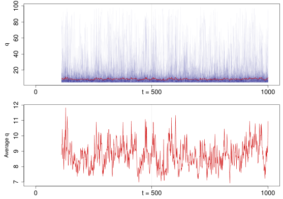
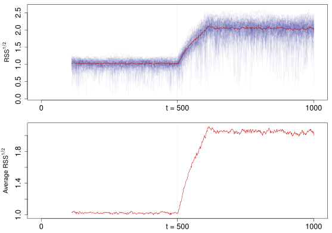
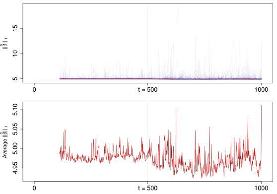
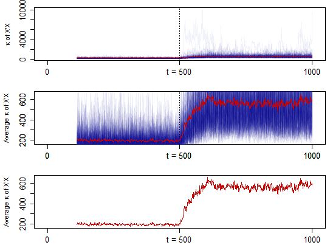

##  **TVP**
```yaml

Name of QuantLet: LCPdesign

Published in : 'Unpublished; Theoritically description of Time Varying 
Penalization method.'

Description : 'Performs LASSO regression in a moving window by using BIC 
criterion to choose penalty parameter (lambda). The simulated data contains 
a break point after which the design matrix changes. Plots time series of 
lambda in LASSO regression. Furthermore, the cardinality of the active set 
q, the L2-norm of the residuals, the L1-norm of the paramter beta  and the 
condition number of the squared design matrix (X'X) are plotted.'

Keywords : 'LASSO, lasso shrinkage, L1-norm penalty, change point, bic,
euclidean norm,regression, simulation, plot, visualization, historical 
moving window,time-series, estimation,L1-norm, error, beta, multi 
dimensional, multivariate normal'

See also : 'MVAgrouplasso, MVAlassocontour, MVAlassoregress, SMSlassocar, 
SMSlassoridge,quantilelasso, FASTECChinaTemper2008, FASTECSAMCVaR, 
TEDAS_strategies'

Author : Lenka Zbonakova

Submitted: 

Example: 
-Lambda
-Cardinality of q
-L2-norm of the residuals
-L1-norm of the beta
-Condition number of (X'X)

```





```R

# Clear variables and close windows
rm(list = ls(all = TRUE))
graphics.off()

# Install and load packages
libraries = c("MASS", "lars", "scales", "mvtnorm")
lapply(libraries, function(x) if (!(x %in% installed.packages())) {
  install.packages(x)} )
lapply(libraries, library, quietly = TRUE, character.only = TRUE)

# Lasso from lars with BIC stopping rule
lasso.bic = function(x, y, win) {
 
  m             = n.param
  n             = n.obs
  xbeta         = numeric(0)
  res           = numeric(0)
  res.norm      = numeric(0)
  coeff.norm    = numeric(0) 
  lambda.bic    = numeric(0)
  lambda.hat    = numeric(0)
  act.set       = numeric(0)
  cond.num      = numeric(0)
  
  for (j in 1:n.sim) {
    
    xbeta1      = numeric(0)
    res1        = numeric(0)
    res.norm1   = numeric(0)
    coeff.norm1 = numeric(0)
    lambda.bic1 = numeric(0)
    lambda.hat1 = numeric(0)
    act.set1    = numeric(0)
    cond.num1   = numeric(0)
    
    for (i in 1:(n - win + 1)) {
      
      # Normalization of columns of x
      ywin          = y[[j]][i:(i + win - 1)]
      xwin          = x[[j]][i:(i + win - 1), ]
      nwin          = nrow(xwin)
      one           = rep(1, nwin)
      meanx         = drop(one %*% xwin)/nwin
      xc            = scale(xwin, meanx, FALSE)
      normx         = sqrt(drop(one %*% (xc^2)))
      names(normx)  = NULL
      xs            = scale(xc, FALSE, normx)
      
      # OLS fit to standardized x
      out.ls        = lm(ywin ~ xs)
      beta.ols      = out.ls$coeff[2:(m + 1)]
      object        = lars(xs, ywin, type = "lasso", normalize = FALSE)
      
      # Get min BIC
      sig2f         = summary(out.ls)$sigma^2
      bic           = log(nwin) * object$df/nwin  + as.vector(object$RSS)/(nwin * sig2f)
      step.bic      = which.min(bic)
      lambda        = object$lambda[step.bic]  # Lambda minimizing BIC
      
      fit           = predict.lars(object, xs, s = step.bic, type = "fit",  
                                   mode = "step")$fit
      coefftmp      = predict.lars(object, xs, s = step.bic, type = "coef", 
                                   mode = "step")$coefficients
      coeff         = coefftmp/normx           # Get unscaled coefficients
      st            = sum(coeff != 0)          # Number of nonzero coefficients
      mse           = sum((ywin - fit)^2)/(nwin - st - 1)
      
      xbtmp         = xwin %*% coeff
      restmp        = ywin - xbtmp
      lambda.tmp    = (t(restmp) %*% xbtmp) / (sqrt(nwin) * sum(abs(coeff)))
      xbeta1        = c(xbeta1, xbtmp)
      res1          = c(res1, restmp)
      res.norm1     = c(res.norm1, sqrt(sum(restmp^2)))
      coeff.norm1   = c(coeff.norm1, sum(abs(coeff)))
      lambda.bic1   = c(lambda.bic1, lambda)
      lambda.hat1   = c(lambda.hat1, lambda.tmp)
      act.set1      = c(act.set1, st)
      cond.num1     = c(cond.num1, kappa(xwin))
    }
    
    xbeta           = cbind(xbeta, xbeta1)
    res             = cbind(res, res1)
    res.norm        = cbind(res.norm, res.norm1)
    coeff.norm      = cbind(coeff.norm, coeff.norm1)
    lambda.bic      = cbind(lambda.bic, lambda.bic1)
    lambda.hat      = cbind(lambda.hat, lambda.hat1)
    act.set         = cbind(act.set, act.set1)
    cond.num        = cbind(cond.num, cond.num1)
    
    print(j)
  } 
  
  mean.rn           = apply(res.norm, 1, mean)
  mean.cn           = apply(coeff.norm, 1, mean)
  mean.lb           = apply(lambda.bic, 1, mean)
  mean.lh           = apply(lambda.hat, 1, mean)
  mean.as           = apply(act.set, 1, mean)
  mean.k            = apply(cond.num, 1, mean)
  
  values            = list(lambda.bic, lambda.hat, act.set, res.norm, coeff.norm, cond.num, 
                           mean.rn, mean.cn, mean.lb, mean.lh, mean.as, mean.k)
  names(values)     = c("lambda.bic", "lambda.hat", "act.set", "res.norm", "coeff.norm", 
                        "cond.num", "mean.rn", "mean.cn", "mean.lb", "mean.lh", "mean.as", 
                        "mean.k")
  return(values)
}

# Simulation setup
n.obs   = 1000      # no of observations
n.param = 100       # no of parameters
n.sim   = 100       # no of simulations
w110    = 110       # moving window size (plots)
w150    = 150
w200    = 200
seed1   = 20150206  # seed simulation X
seed2   = 20150602  # seed simulation epsilon

# Check if n.obs is even (otherwise add one observation)
if(n.obs %% 2 == 1) n.obs = n.obs + 1 ;
n.cp  = n.obs/2

# True beta coefficients
tmp1  = c(1, 1, 1, 1, 1)
tmp2  = rep(0, 95)
b     = c(tmp1, tmp2)

# Simulation of the design matrix
mu1   = rep(0, n.param)
mu2   = rep(15, n.param)
r     = 0.5
Sigma = matrix(0, nrow = n.param, ncol = n.param)

for (i in 1:n.param) {
  for (j in 1:n.param) {
    if (i == j){
      Sigma[i, j] = 1
    }else {
      Sigma[i, j] = r^abs(i - j)
    }
  }
}

X = list()
set.seed(seed1)
for (i in 1:n.sim){
  X1     = mvrnorm(n = n.cp, mu1, Sigma)
  X2     = rmvt(n = (n.obs - n.cp), sigma = Sigma, df = 2)
  X[[i]] = rbind(X1, X2)
} 

### Change of the variance of the error term in t = n.cp 
# Simulation of the error term for t = 1, ..., n.cp
eps  = list()
set.seed(seed2)
for (i in 1:n.sim){
  eps[[i]] = rnorm(n.obs, mean = 0, sd = 0.1)
} 

# Computation of Y
Y    = list()
for (i in 1:n.sim){
  Y.tmp = numeric(0)
  for (j in 1:n.obs){
    Y.tmp = c(Y.tmp, b %*% X[[i]][j, ] + eps[[i]][j])
  }
  Y[[i]] = Y.tmp
}
plot(Y[[1]])


# Lasso estimation with LARS for moving window of length w 
out_var110  = lasso.bic(X, Y, w110)
out_var150  = lasso.bic(X, Y, w150)
out_var200  = lasso.bic(X, Y, w200)
out_var     = out_var110
w           = w110


par(mfrow = c(4,1))
# Lambda
par(mar = c(3, 5, 1, 1))
plot(out_var$lambda.bic[, 1], type = "l",  col =  alpha("darkblue", 0.05), axes = FALSE, 
     xlab = "", frame = TRUE, cex.main = 1.5, ylab = expression(paste(lambda)),
     xlim = c(-(w + 10), (n.obs - w + 10)), ylim = c(min(out_var$lambda.bic), max(out_var$lambda.bic)))
axis(1, at = c(-w, n.cp - w, n.obs - w), labels = c("0", paste(expression("t ="), n.cp), n.obs),
     cex.axis = 1.2)
axis(2, cex.axis = 1.2)
abline(v = (n.cp - w), lty = 3)
for (i in 2:n.sim) {
  tmp = out_var$lambda.bic[, i]
  lines(tmp, col = alpha("darkblue", 0.05))
}
lines(out_var$mean.lb, col = "red3")

mean(out_var$mean.lb[1:390])
mean(out_var$mean.lb[390:500])
mean(out_var$mean.lb[500:890])
length(out_var$mean.lb)

plot(out_var$mean.lb, type = "l",  col = "red3", axes = FALSE, 
     frame = TRUE, cex.main = 1.5, ylab = expression(paste("Average ", lambda)),
     xlim = c(-(w + 10), (n.obs - w + 10)), ylim = c(min(out_var$mean.lb), max(out_var$mean.lb)))
axis(1, at = c(-w, n.cp - w, n.obs - w), labels = c("0", paste(expression("t ="), n.cp), n.obs),
     cex.axis = 1.2)
axis(2, cex.axis = 1.2)
abline(v = (n.cp - w), lty = 3)

# Cardinality of active set q
par(mar = c(3, 5, 1, 1))
plot(out_var$act.set[, 1], type = "l", col = alpha("darkblue", 0.05), axes = FALSE, xlab = "", frame = TRUE, cex.main = 1.5,
     ylab = "q", xlim = c(-(w + 10), (n.obs - w + 10)), ylim = c(min(out_var$act.set), max(out_var$act.set)))
axis(1, at = c(-w, n.cp - w, n.obs - w), labels = c("0", paste(expression("t ="), n.cp), n.obs),
     cex.axis = 1.2)
axis(2, cex.axis = 1.2)
abline(v = (n.cp - w), lty = 3)
for (i in 2:n.sim) {
  tmp = out_var$act.set[, i]
  lines(tmp, col = alpha("darkblue", 0.05))
}
lines(out_var$mean.as, col = "red3")

plot(out_var$mean.as, type = "l",  col = "red3", axes = FALSE, 
     frame = TRUE, cex.main = 1.5, ylab = "Average q",
     xlim = c(-(w + 10), (n.obs - w + 10)), ylim = c(min(out_var$mean.as), max(out_var$mean.as)))
axis(1, at = c(-w, n.cp - w, n.obs - w), labels = c("0", paste(expression("t ="), n.cp), n.obs),
     cex.axis = 1.2)
axis(2, cex.axis = 1.2)
abline(v = (n.cp - w), lty = 3)

# L2-norm of residuals 
par(mar = c(3, 5, 1, 1))
plot(out_var$res.norm[, 1], type = "l", col = alpha("darkblue", 0.05), axes = FALSE, xlab = "", 
     frame = TRUE, cex.main = 1.5, ylab = expression(paste("RSS" ^ {1/2})), 
     xlim = c(-(w + 10), (n.obs - w + 10)), ylim = c(min(out_var$res.norm), max(out_var$res.norm)))
axis(1, at = c(-w, n.cp - w, n.obs - w), labels = c("0", paste(expression("t ="), n.cp), n.obs),
     cex.axis = 1.2)
axis(2, cex.axis = 1.2)
abline(v = (n.cp - w), lty = 3)
for (i in 2:n.sim) {
  tmp = out_var$res.norm[, i]
  lines(tmp, col = alpha("darkblue", 0.05))
}
lines(out_var$mean.rn, col = "red3")

plot(out_var$mean.rn, type = "l",  col = "red3", axes = FALSE, 
     frame = TRUE, cex.main = 1.5, ylab = expression(paste("Average RSS" ^ {1/2})),
     xlim = c(-(w + 10), (n.obs - w + 10)), ylim = c(min(out_var$mean.rn), max(out_var$mean.rn)))
axis(1, at = c(-w, n.cp - w, n.obs - w), labels = c("0", paste(expression("t ="), n.cp), n.obs),
     cex.axis = 1.2)
axis(2, cex.axis = 1.2)
abline(v = (n.cp - w), lty = 3)

# L1-norm of Beta
par(mar = c(3, 5, 1, 1))
plot(out_var$coeff.norm[, 1], type = "l", col = alpha("darkblue", 0.05), axes = FALSE, xlab = "", 
     frame = TRUE, cex.main = 1.5, ylab = expression(paste("||", hat(beta), "|| " [1])), 
     xlim = c(-(w + 10), (n.obs - w + 10)), ylim = c(min(out_var$coeff.norm), max(out_var$coeff.norm)))
axis(1, at = c(-w, n.cp - w, n.obs - w), labels = c("0", paste(expression("t ="), n.cp), n.obs),
     cex.axis = 1.2)
axis(2, cex.axis = 1.2)
abline(v = (n.cp - w), lty = 3)
for (i in 2:n.sim) {
  tmp = out_var$coeff.norm[, i]
  lines(tmp, col = alpha("darkblue", 0.05))
}
lines(out_var$mean.cn, col = "red3")

plot(out_var$mean.cn, type = "l",  col = "red3", axes = FALSE, 
     frame = TRUE, cex.main = 1.5, ylab = expression(paste("Average ||", hat(beta), "|| " [1])),
     xlim = c(-(w + 10), (n.obs - w + 10)), ylim = c(min(out_var$mean.cn), max(out_var$mean.cn)))
axis(1, at = c(-w, n.cp - w, n.obs - w), labels = c("0", paste(expression("t ="), n.cp), n.obs),
     cex.axis = 1.2)
axis(2, cex.axis = 1.2)
abline(v = (n.cp - w), lty = 3)

# Condition number of X'X
par(mar = c(3, 5, 1, 1))
plot(out_var$cond.num[, 1], type = "l", col = alpha("darkblue", 0.05), axes = FALSE, xlab = "", 
     frame = TRUE, cex.main = 1.5, ylab = expression(paste(kappa, " of X'X")), 
     xlim = c(-(w + 10), (n.obs - w + 10)), ylim = c(min(out_var$cond.num), max(out_var$cond.num)))
axis(1, at = c(-w, n.cp - w, n.obs - w), labels = c("0", paste(expression("t ="), n.cp), n.obs),
     cex.axis = 1.2)
axis(2, cex.axis = 1.2)
abline(v = (n.cp - w), lty = 3)
for (i in 2:n.sim) {
  tmp = out_var$cond.num[, i]
  lines(tmp, col = alpha("darkblue", 0.05))
}
lines(out_var$mean.k, col = "red3")

plot(out_var$mean.k, type = "l",  col = "red3", axes = FALSE, 
     frame = TRUE, cex.main = 1.5, ylab = expression(paste("Average ", kappa, " of X'X")),
     xlim = c(-(w + 10), (n.obs - w + 10)), ylim = c(min(out_var$mean.k), max(out_var$mean.k)))
axis(1, at = c(-w, n.cp - w, n.obs - w), labels = c("0", paste(expression("t ="), n.cp), n.obs),
     cex.axis = 1.2)
axis(2, cex.axis = 1.2)
abline(v = (n.cp - w), lty = 3)
```
